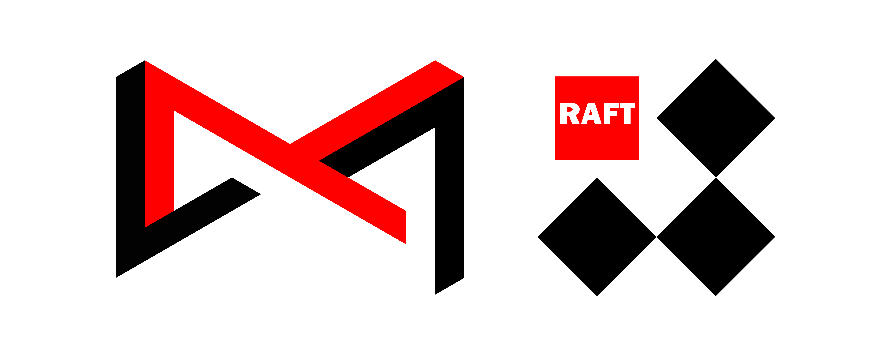

[Raft Consensus Algorithm](https://raft.github.io/) implementation used by FOIVER system.

## Usage

Use raft-foiver as a library rather than a framework.
Please refer to the usage example in [raftexample](./raftexample).

- [raftexample](./raftexample): Example Usage
- [raftrpc](./raftrpc): RPC Transport
- [raftthrift](./raftthrift): Thrift IDL

## Credits

RAFT-FOIVER is inspired by [etcd-io/raft](https://github.com/etcd-io/raft), without which this project would not have been possible.

## License

RAFT-FOIVER is distributed under the [Apache License 2.0](./LICENSE). The licenses of third party dependencies of RAFT-FOIVER are explained [here](./licenses).

## ECOLOGY

  
RAFT is Part of <a href="https://github.com/B1NARY-GR0UP">PROJECT: FOIVER</a>

